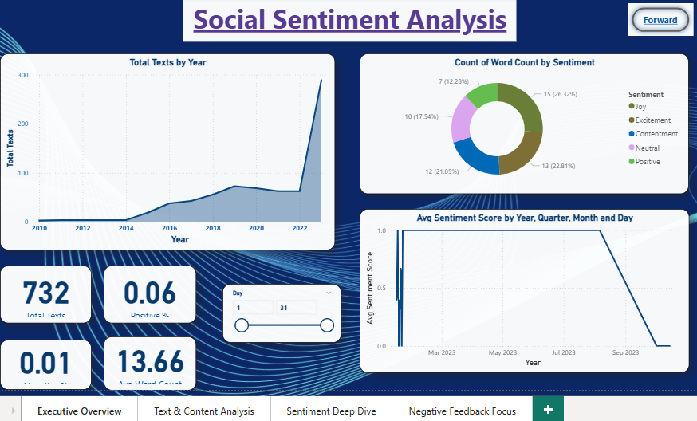

# Sentiment Analysis Dashboard
This project analyzes text data using Python and visualizes insights using Power BI.

## Tools Used
- Python (Pandas, NLTK, Matplotlib)
- Power BI
- NLP

## Steps Performed
- Data cleaning and preprocessing
- Sentiment analysis
- Visualization using Power BI

## Dashboard Preview

## Power BI Dashboard
You can download and explore the dashboard here:
[Download Dashboard](Sentiment_analysis.pbix)

## Insights
- Sentiment trends vary over time
- Negative texts tend to be longer
- Keyword analysis helps identify common themes
